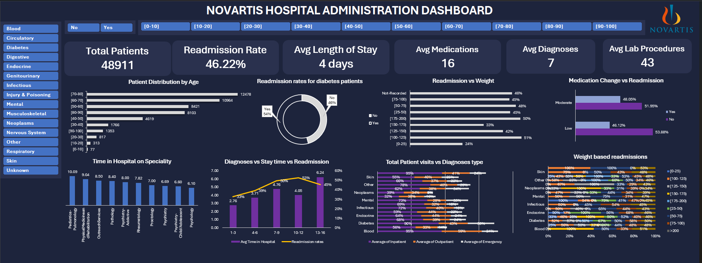

# 🏥 Novartis Hospital Administration Analysis using Microsoft Excel
<p align="center">
  
</p>
---

## 📖 Project Overview


This project presents a comprehensive healthcare analytics solution developed using **Microsoft Excel** to analyze hospital administration data and identify the major factors contributing to patient readmissions.

The primary objective is to support hospital administrators in improving patient care, reducing unnecessary readmissions, optimizing resource utilization, and enabling data-driven decision-making through interactive dashboards and analytical insights.

The project involves end-to-end data analytics, including:

- Data Cleaning
- Data Preparation
- Exploratory Data Analysis (EDA)
- Statistical Analysis
- Feature Engineering
- Interactive Dashboard Development
- Business Insights & Recommendations

The project addresses all **20 analytical questions (10 Basic + 10 Medium Level)** from the healthcare case study using Excel-based analytical techniques.

---

# 🎯 Problem Statement

Hospital readmissions significantly impact healthcare quality, hospital efficiency, and operational costs. High readmission rates often indicate potential gaps in patient care, discharge planning, medication management, or follow-up services.

The objective of this project is to analyze historical hospital admission records to identify factors influencing readmissions and recommend actionable strategies that improve patient outcomes while optimizing hospital operations.

---

# 🎯 Project Objectives

- Analyze patient demographics and hospitalization patterns.
- Identify factors associated with hospital readmissions.
- Evaluate diagnosis-wise and specialty-wise hospital performance.
- Analyze medication and diabetes management trends.
- Study healthcare utilization before admission.
- Build an interactive Excel dashboard for decision-makers.
- Generate business recommendations based on analytical findings.

---

# 🗂 Dataset Information

**Domain:** Healthcare Analytics

**Dataset:** Hospital Administration Dataset

The dataset contains patient-level hospital records including:

- Patient Demographics
- Hospital Admissions
- Medical Specialties
- Diagnosis Codes
- Laboratory Procedures
- Medication Details
- Diabetes Information
- Healthcare Utilization
- Readmission Status

### Important Variables

- Encounter ID
- Patient ID
- Age
- Gender
- Race
- Weight
- Medical Specialty
- Time in Hospital
- Number of Lab Procedures
- Number of Procedures
- Number of Medications
- Number of Diagnoses
- Previous Outpatient Visits
- Previous Emergency Visits
- Previous Inpatient Visits
- Diagnosis Codes
- Diabetes Medication
- Medication Change
- Readmitted
- X1–X25 Medication Indicators

---

# 🛠 Tools & Technologies Used

| Tool | Purpose |
|------|---------|
| Microsoft Excel | Data Analysis |
| Pivot Tables | Data Summarization |
| Pivot Charts | Visualization |
| Excel Dashboard | Interactive Reporting |
| Power Query | Data Cleaning |
| Conditional Formatting | Heatmaps & KPIs |
| Excel Formulas | Data Transformation |
| Slicers | Interactive Filtering |

---

# 🧹 Data Cleaning & Preprocessing

Before performing analysis, the dataset was cleaned and transformed to ensure accuracy.

### Data Cleaning Activities

- Removed duplicate records after validation.
- Handled missing values appropriately.
- Preserved valid weight records for weight-based analysis.
- Standardized inconsistent categorical values.
- Cleaned diagnosis codes.
- Validated encounter and patient identifiers.
- Created meaningful categorical variables.
- Removed unnecessary formatting inconsistencies.

---

# ⚙️ Feature Engineering

To support advanced analysis, several derived columns were created.

### Newly Created Columns

- Diagnosis Category (DiagType)
- Medication Adjustment Score
- Medication Adjustment Level
- Readmission Flag
- Weight Categories
- Emergency Visit Bins
- Age Groups

These engineered features enabled deeper business analysis beyond the raw dataset.

---

# 📊 Project Analysis

The project addresses **20 analytical business questions**.

## Basic Analysis

- Readmission trends by Age
- Average Length of Stay
- Emergency Visits vs Readmission
- Diabetes Readmission Analysis
- Medication Change Analysis
- Lab Procedures Analysis
- Race & Gender Comparison
- Weight Category Analysis
- Medication Impact on Hospital Stay
- Outpatient Visits Analysis

---

## Medium Analysis

- Comorbidity Analysis
- Demographic Treatment Analysis
- Diagnosis-wise Healthcare Utilization
- Medication Prescribing Patterns
- Weight vs Diagnosis Analysis
- Medication Effectiveness
- Readmission Risk Analysis
- Clinical Resource Utilization
- Hospital Outcome Analysis
- Executive Healthcare Insights

---

# 📈 Dashboard Overview

An interactive executive dashboard was designed to summarize all major findings.

### KPI Cards

- 👥 Total Patients
- 📈 Readmission Rate
- 🏥 Average Length of Stay
- 💊 Average Medications
- 🩺 Average Diagnoses
- ⚕️ Average Medication Adjustment Score

---

### Dashboard Visualizations

- Patient Distribution by Age
- Readmission Distribution
- Readmission by Diagnosis
- Medication Adjustment vs Readmission
- Weight Category vs Readmission
- Average Length of Stay by Diagnosis
- Medical Specialty Distribution
- Emergency Visits vs Readmission

---

### Interactive Filters

- Age
- Diagnosis Category
- Readmission Status

---

# 📌 Key Insights

The analysis generated several meaningful healthcare insights.

- Majority of hospital admissions belong to elderly patients.
- Readmission rates vary across diagnosis categories.
- Patients requiring higher medication adjustments tend to have higher readmission rates.
- Weight and diagnosis combinations help identify high-risk patient groups.
- Previous emergency visits are associated with increased readmission risk.
- Certain medical specialties require longer average hospital stays.
- Diabetes medication management influences readmission patterns.

---

# 💼 Business Recommendations

Based on the findings, the following recommendations are proposed:

- Strengthen discharge planning for high-risk patients.
- Improve medication reconciliation before discharge.
- Enhance diabetes management programs.
- Increase monitoring of elderly patients.
- Implement targeted follow-up programs.
- Improve preventive healthcare services.
- Optimize staffing for high workload specialties.
- Monitor patients with multiple diagnoses more closely.

---

# ⚠ Challenges Faced

Several real-world data challenges were encountered during the project.

- Missing values in Weight column.
- Duplicate Encounter IDs requiring validation.
- Anonymous medication variables (X1–X25).
- Mixed medication and laboratory indicator variables.
- Inconsistent diagnosis coding.
- Lack of patient satisfaction data.
- Absence of admission dates for seasonal analysis.
- Extensive feature engineering required for advanced analysis.

---

# 🚀 Future Scope

The project can be extended using advanced analytics techniques.

Future enhancements include:

- Machine Learning Readmission Prediction
- Power BI Dashboard Development
- SQL Database Integration
- Predictive Risk Scoring
- Patient Segmentation using Clustering
- Financial Impact Analysis
- Integration of Patient Satisfaction Data
- Automated ETL Pipeline

---

# 📚 Skills Demonstrated

This project demonstrates practical experience in:

- Data Cleaning
- Exploratory Data Analysis (EDA)
- Excel Dashboard Development
- Pivot Tables & Pivot Charts
- KPI Development
- Healthcare Analytics
- Statistical Analysis
- Business Intelligence
- Data Visualization
- Executive Reporting
- Business Problem Solving

---

# 📂 Repository Structure

```text
Hospital-Administration-Analysis/
│
├── 📄 README.md
├── 📊 Hospital Administration Analysis.xlsx
├── 📑 DACS08 - Hospital Administration Analysis.pdf
├── 📷 Dashboard Screenshot.png
└── 📁 Images
```

---

# 🎓 Learning Outcomes

Through this project, the following concepts were applied:

- Healthcare Data Analytics
- Data Preparation & Cleaning
- Feature Engineering
- Pivot Table Analysis
- Business KPI Development
- Dashboard Design
- Interactive Reporting
- Decision Support Analytics

---

# 📌 Conclusion

This project demonstrates how Microsoft Excel can be effectively utilized as a complete Business Intelligence tool for healthcare analytics.

By transforming raw hospital administration data into meaningful dashboards, KPIs, and actionable insights, the project provides valuable recommendations for reducing patient readmissions, improving healthcare quality, optimizing hospital resource utilization, and supporting evidence-based decision-making.

The interactive dashboard serves as an executive reporting solution that enables hospital administrators to monitor operational performance, identify high-risk patient groups, and make informed strategic decisions to enhance patient care.
